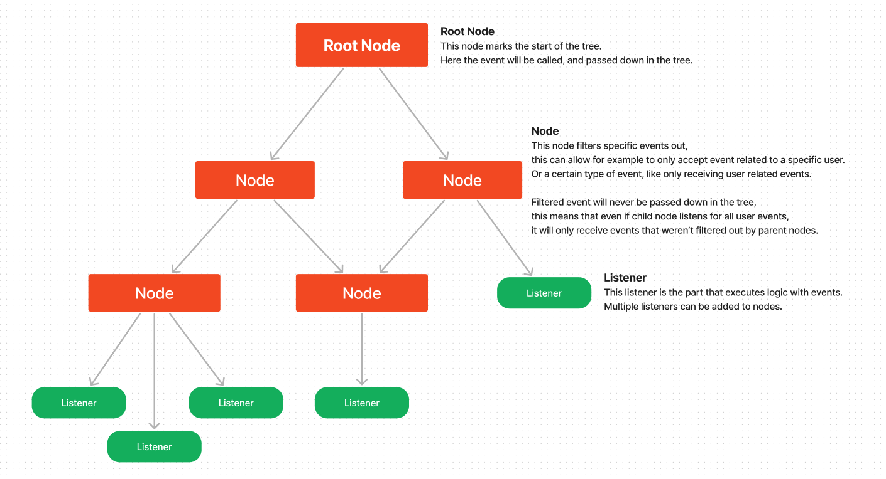

# EventFlow — Multithreaded Event System 🔔

EventFlow is a multithreaded tree structured event system.
Mainly inspired by the [Minestom Project](https://minestom.net)

## Why ?
EventFlow was created to make strong, universal and easy to use API for events.
It simplifies the process of event filtering and is ready for multithreaded environments.

## How does it work ?
EventFlow is structured as a tree, composed of nodes and listeners.


## Usage
EventFlow has a fully fledged and documented api, and it is quite easy to use.

### Importing
**Gradle**
````groovy
repositories {
    maven {
        url "https://repository.atlasworld.fr/repository/maven-public/"
    }
}

dependencies {
    implementation "fr.atlasworld.event:flow:${eventflow_version}"
}
````

### API
The API is mainly composed of three components
- **EventNode**: The nodes that compose the tree, those receive the events, filters them out and passes it to **Listeners** and child **EventNodes**.
- **Listener**: Listeners are the part that executes the logic, itself separated into two. **Listeners** have a rich API that offers much control on how and when listeners are controlled.
- **Event**: Those are the actual events that are being processed by the tree.

### EventNodes
The first thing that you will need is a root-node, there is no actual RootNode class.
A root node is an EventNode from which all children nodes will be added.
````java
// Create the root node.
EventNode<Event> rootNode = EventNode.create("root");

// Create child nodes
EventNode<Event> childNode = eventNode.create("child");
rootNode.addChildNode(childNode);

// Alternative way to create child nodes
EventNode<Event> childNode = rootNode.createChildNode("child");
````
Child nodes can filter out events, 
this allows them to only listen for specific event type like server specific events, 
or event listen for events related to one specific event.
````java
// RootNode
EventNode<Event> rootNode = EventNode.create("root");

// Node to only listen for ServerEvent (Example)
EventNode<ServerEvent> serverNode = EventNode.create("servers", ServerEvent.class);
rootNode.addChildNode(serverNode);

// Node to only listen for UserEvent related to a specific user (Example)
EventNode<UserEvent> exampleUserNode = EventNode.create("user-example", UserEvent.class, 
        event -> event.user().username().equals("example"));
rootNode.addChildNode(exampleUserNode);
````

### Listeners
Listeners can be done it two ways, with Lambdas or in a more Bukkit style, 
using a class that implements the EventListener class.

No matter which way you choose the listener will always be accompanied by a EventListenerBuilder
that allows you to specify options to your listener.

One important setting is the ``EventListenerBuilder#executor(EventExecutor executor)``,
this allows the execution of the event to be delegated to a different system or thread.
By implementing the ``EventExecutor`` and overriding the ``request(EventRequest request)`` method,
it can be passed to a queue for executing later.

> [!CAUTION]
> Using multiple threads to handle event will require event to be **Thread-Safe!**

Documentation on the other events can be found in the javadoc.

**Using Lambdas**
Lambda's a pretty straight-forward, you provide the event class you want to listen for, 
the logic to be executed when the event is called, and finally a builder for your event settings.
````java
EventNode<Event> rootNode = EventNode.create("root");

rootNode.addListener(UserSendMessageEvent.class, event -> event.getMessage().strip(), builder -> builder
        .executor(EventExecutor.syncExecutor) // Set the executor that will execute this logic.
        .failure(cause -> System.err.println("EventListener failed with: " + cause)) // Custom Error handling when the handling fails.
        .filter(event -> event.getMessage() != null) // Even more filtration events.
);
````

**Using EventListener**
If you come from Bukkit/Spigot/Paper you may prefer this way of doing.

First you need to create a class implementing the ``EventListener`` interface
and create methods within in your class annotated by ``@EventHandler`` that will

> [!IMPORTANT]  
> The methods annotated by ``@EventHandler`` can only take one parameter and this parameter must extend the ``Event`` interface!

````java
public class UserListener implements EventListener {
    
    @EventHandler
    public void onUserConnect(UserConnectEvent event) {
        // Logic
    }
    
    @EventHandler
    public void onUserSendMessage(UserSendMessageEvent event) {
        // Logic
    }
    
    @EventHandler
    public void onUserDisconnect(UserDisconnectEvent event) {
        // Logic
    }
}
````

Now that we have our ``EventListener`` we need to register it.
````java
EventNode<Event> rootNode = EventNode.create("root");

// Register the event listener
rootNode.addListener(new UserListener(), builder -> builder
        .expireCount(50) // Expire after being executed 50 times.
);
````

### Events
Creating event is quite easy, you simply extend the ``Event`` interface.

> [!TIP]
> It's recommended to create sub event types to categorize your events,
> like using a base event class named ```ServerEvent``` for all server related events, 
> with base methods that are shared between all events, ex ``getServer()``.

````java
public class CustomEvent extends Event {
    private final String message;
    
    public CustomEvent(String message) {
        this.message = message;
    } 
    
    public String getMessage() {
        return this.message;
    }
}
````
> [!NOTE]  
> Event that listener executes on multiple threads should be thread-safe!